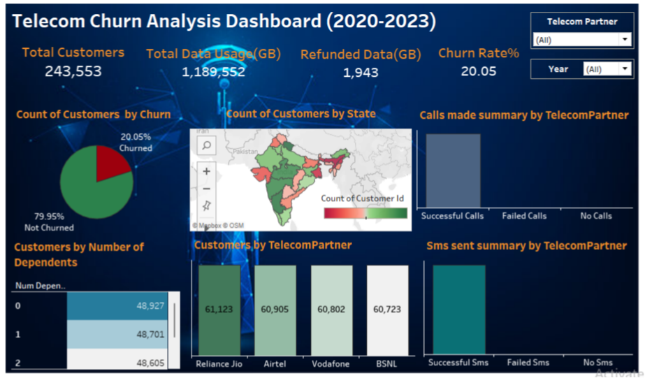

# 📞 Telecom-Churn-Analysis (2020-2023):
An end-to-end **Telecom Customer Churn Analysis** project using **Excel**, **MySQL** and **Tableau**.  
This analysis project explores customer churn behavior, telecom partner influence, and subscription patterns across the years **2020 to 2023**.

## 🔧 Tools Used:
- Microsoft Excel - Data Cleaning and Feature Engineering
- MySQL - SQL queries to extract business insights 
- Tableau - Interactive Dashboard Creation & Filtering

## 📂 Project Structure:
- data/ - Zipped dataset file (.zip) containing the cleaned dataset file (.csv format)
- sql/ - SQL file (.sql) which consists of business insight queries  
- dashboard/ - Tableau dashboard file (.twbx)

## 📊 Insights Uncovered:

🔗 Interactive Tableau Dashboard:
https://public.tableau.com/app/profile/sakshi.kamble6871/viz/Telecom_Churn_Analysis_17816855352100/TelecomChurnDashboard
- Key KPIs such as Total Customers, Churn Rate, Refunded Data, etc
- Churned vs Non-Churned Customer Distribution
- Number of Customers by State
- Calls Made Summary
- SMS Sent Summary
- Interactive filtering by Telecom Partner and Year
- Extra insights explored in Tableau sheets (not shown in the final dashboard)

> 🧩 **Note:** Individual Tableau sheets have white-colored axes and titles intentionally. 
This is to blend well with the **custom dashboard background**, creating a cleaner visual appearance. You may see text only when hovering the charts.

## 📁 **Dataset Information:** 
The original dataset was downloaded from Kaggle.  
Only the **cleaned and feature-engineered** dataset is included in this repository for analysis.

> ⚠️ **Disclaimer:** This dataset is used for educational and portfolio purposes only.
